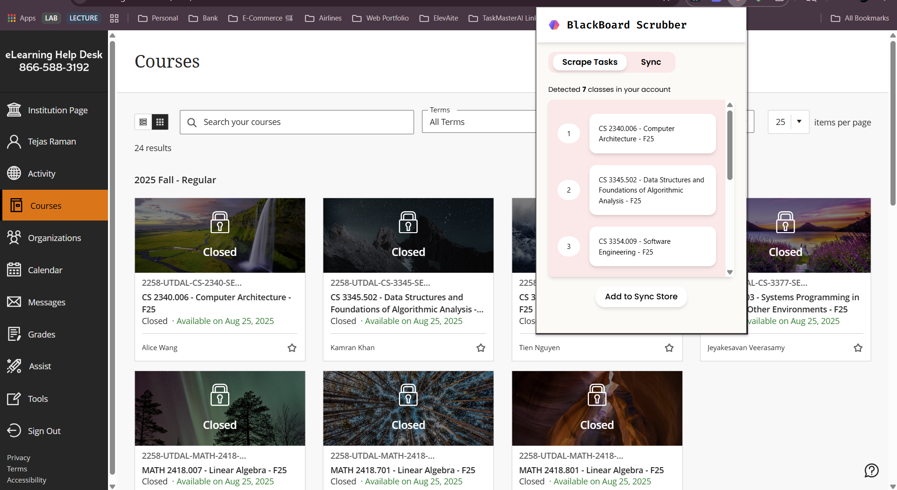

# BlackBoard Scrubber
  
<br>

<p align="center">
 
</p>

<p align="center">
   
   
   
   
</p>

<p align="center">
   
   
</p>

## 🚀 About

**BlackBoard Scrubber** is a powerful Chrome extension designed to scrape your tasks and classes from the BlackBoard eLearning portal using the DOM. This tool automates the tedious process of manually adding assignments and classes from Blackboard to Google Calendar.

### ✨ Key Features

- **Super Fast**: Instantly scrape all tasks and classes in seconds
- **Multiple Export Options**: Download data as CSV files or sync directly with ElevAIte portal
- **Calendar Integration**: Seamlessly sync assignments with Google Calendar
- **Automation Tools**: Powerful automation capabilities to speed up your scheduling workflows

Transform your academic management from manual drudgery to automated efficiency with BlackBoard Scrubber. 

### ⁉️Issues
<div align="center">
  <a href="https://github.com/traman2/BlackBoard-Scrubber/issues?q=is%3Aissue%20label%3Astatus%3Acomplete"></a>
  <a href="https://github.com/traman2/BlackBoard-Scrubber/issues?q=is%3Aissue%20label%3Astatus%3Apending"></a>
  <a href="https://github.com/traman2/BlackBoard-Scrubber/issues?q=is%3Aissue%20label%3Astatus%3Areview"></a>
  <a href="https://github.com/traman2/BlackBoard-Scrubber/issues?q=is%3Aissue%20label%3Astatus%3Atodo"></a>
  <a href="https://github.com/traman2/BlackBoard-Scrubber/issues?q=is%3Aissue%20label%3Astatus%3Aworking"></a>
</div>
<div align="center">
  
</div>
<div align="center">
  
</div>
<div align="center">
  
</div>
<div align="center">
  
</div>
<div align="center">
  
</div>
<div align="center">
  
</div>
<div align="center">
  <a href="https://github.com/traman2/BlackBoard-Scrubber/issues?q=is%3Aissue%20sort%3Aupdated-desc"></a>
</div>


### 🛠️ Setup & Installation

#### Prerequisites
- Node.js (v16 or higher)
- npm or yarn
- Google Chrome browser

#### Installation Steps

1. **Clone the repository**
   ```bash
   git clone https://github.com/traman2/BlackBoard-Scrubber.git
   cd BlackBoard-Scrubber
   ```

2. **Install dependencies**
   ```bash
   npm install
   # or
   yarn install
   ```

3. **Build the extension**
   ```bash
   npm run build
   # or
   yarn build
   ```

4. **Load the extension in Chrome**
   - Open Chrome and navigate to `chrome://extensions/`
   - Enable "Developer mode" in the top right
   - Click "Load unpacked" and select the `dist` folder
   - The BlackBoard Scrubber extension should now appear in your extensions

5. **That's it!**

### 🖥️ Usage
Once the BlackBoard Scrubber Extension is setup and working properly, click on the `Get My Courses` button and watch the extension work its magic and instantly render all the classes you're currently enrolled in this tear. 

## ❓ FAQ
**Q: Is this extension safe to use with my Blackboard account?**  
A: Yes! BlackBoard Scrubber only reads publicly available information from your Blackboard dashboard. It doesn't store or transmit your login credentials as the scraping process occurs after you login.

**Q: Which universities/institutions are supported?**  
A: The extension works with any institution that uses the standard Blackboard Learn platform. If you encounter issues with your specific institution, please open an issue. Adjust the domain names in the background and content scripts from utdallas to your unviersity of choice. 

**Q: Can I export my data to other calendar apps?**  
A: Currently, the extension supports Google Calendar integration and CSV export. The CSV file can be imported into most calendar applications. *The Google Calendar sync feature is still under active development*

**Q: What data does the extension scrape?**  
A: The extension only scrapes course information, assignment details, and due dates from your Blackboard dashboard. Future plans are to also scrape the grades feature. If you'd like, you can fork this repository, add any features you like, and submit a pull request. 

**Q: I'm getting an error when trying to scrape data. What should I do?**  
A: Make sure you're logged into Blackboard. The service workers check the domain to see if you are on the elearning.[university].edu
